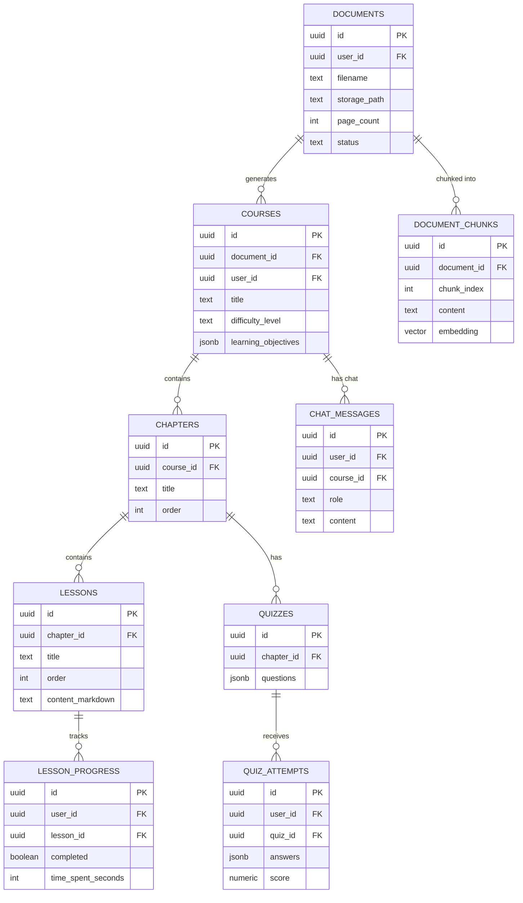

# PDF → E-Course Learning Platform

## Day 1 scope (done)
- Supabase Auth (Google OAuth) — frontend login + callback
- PDF upload endpoint — extracts text via PyMuPDF, stores file in Supabase Storage,
  saves metadata (documents table)
- DB schema for the full app (schema.sql) — run this once in Supabase SQL editor

## Day 2 scope (done)
- Text chunking (`app/services/chunking.py`) — overlapping word-based chunks
- Local embeddings (`app/services/embeddings.py`) — sentence-transformers,
  all-MiniLM-L6-v2, 384-dim, free/no API cost
- Vector storage (`app/services/vector_store.py`) — chunks + embeddings persisted
  to `document_chunks` (pgvector), with a cosine-similarity retrieval function
  ready for the Day 4 RAG chatbot
- AI course generation (`app/core/llm.py` + `app/routers/courses.py`) — Groq LLM
  turns extracted text into a structured course (title, objectives, chapters,
  lessons) as strict JSON, persisted to courses/chapters/lessons tables
- New endpoints: `POST /courses/generate/{document_id}`, `GET /courses/`,
  `GET /courses/{course_id}`

### Auth note
Backend auth verification (`app/core/auth.py`) uses the official Supabase
Python client's `auth.get_user(token)` rather than manual JWT decoding — this
works regardless of whether the project uses the legacy shared HS256 secret
or the newer asymmetric signing keys, so no extra config is needed either way.

## Database schema



See `backend/schema.sql` for the full DDL including indexes and RLS policies.

## Setup

### 1. Supabase project
1. Create a project at supabase.com
2. SQL editor → paste `backend/schema.sql` → run
3. Storage → create a bucket named `documents` (private)
4. Authentication → Providers → enable Google, add your OAuth client id/secret
5. Authentication → URL Configuration → add `http://localhost:3000/auth/callback`
6. Copy: Project URL, anon key, service_role key, JWT secret, DB connection string

### 2. Backend
```bash
cd backend
python -m venv venv && source venv/bin/activate   # or venv\Scripts\activate on Windows
pip install -r requirements.txt
cp .env.example .env    # fill in Supabase + Groq values
uvicorn app.main:app --reload --port 8000
```
Visit http://localhost:8000/health -> {"status": "ok"}

### 3. Frontend
```bash
cd frontend
npm install
cp .env.local.example .env.local   # fill in Supabase URL + anon key
npm run dev
```
Visit http://localhost:3000 -> redirects to /login -> Google login -> /upload

### 4. Test the flow
1. Log in with Google
2. Upload a PDF on /upload
3. You should see page count, char count, and a text preview
4. Check Supabase: `documents` table has a new row, Storage bucket has the file

## What's NOT in Day 1 (coming next)
- Day 2: chunk extracted text -> embeddings -> document_chunks (RAG) -> LLM course generation (Groq)
- Day 3: progress tracking + dashboard UI
- Day 4: RAG chatbot + quiz generation
- Day 5: deploy (Vercel + Render/Railway) + polish + demo video

## Notes
- `Base.metadata.create_all` in `main.py` auto-creates tables on startup for local dev
  convenience — but the RLS policies in `schema.sql` only apply if you run schema.sql
  directly in Supabase. Prefer running schema.sql once and removing create_all before deploying.
- Backend uses the Supabase **service_role** key (bypasses RLS) since it does its own
  JWT-based auth check per request via `app/core/auth.py`.
